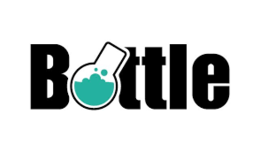

# Status for Hacktoberfest Challenge
This is a small project created to practice with Github API, setting up the example of a challenge where you would get a price if you do 4 PR. We would need then to check how many PR a certain user would have done to the repo of our choice.

# Tech
- I will be using Bottle, which is a a fast, simple and lightweight WSGI micro web-framework for Python.
	

- That said, of course I will be using Python 3.7.
	
	
